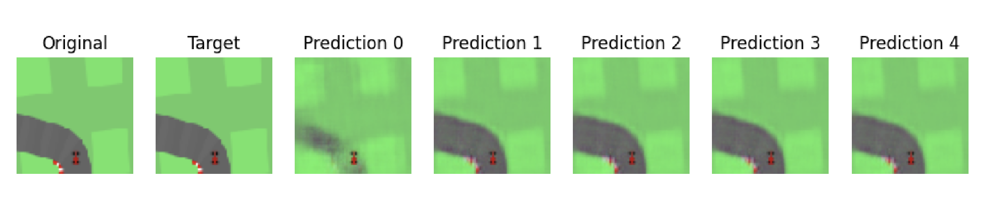

## World Models
This is a reproduction of the [World Models](https://arxiv.org/abs/1803.10122) paper.

### Setup
```
uv sync
```
### Training VAE/RNN

```
uv run -m src.train.train_vae --config ./configs/vae.yaml 
uv run -m src.train.train_rnn --config ./configs/rnn.yaml 
```

The RNN is trained to predict the next latent state which can be visualized by decoding with the VAE




### Training Controller

```
uv run -m src.train.train_controller --vae_path [] --rnn_path []
```


### Eval Model

```
uv run -m src.eval --vae_path [] --rnn_path [] --controller_path []
```